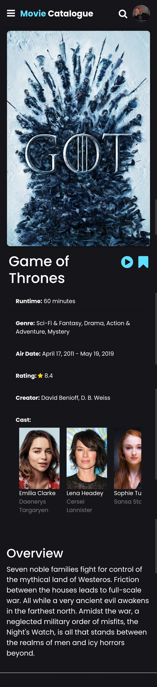
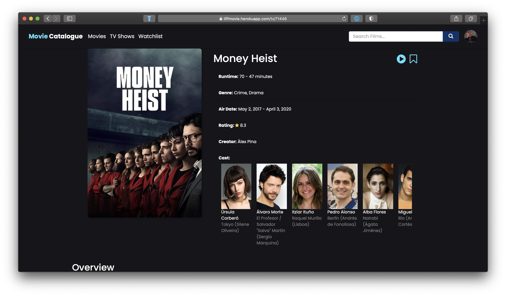

# MovieCatalogue-LIFF
Basically the same as my android The Movie Catalogue, but you can run this on any browser you have on your phone and computer.
And if you run this from LINE Messenger app, you can get LIFF (LINE Front-end Framework) features that browser doesn't version have.

## Screenshot
&nbsp;

### App Features
* [x] Showing movies
* [x] Movies Search
* [x] Movies Detail
* [x] Movies sharing through LINE Messenger

### Sample
https://liff.line.me/1653723806-zZml2obV (or you can access https://simplemoviecatalogue.herokuapp.com)

### Configuration
- `MOVIE_DB_API` at `api-transaction.js`: Your TMDB API key
- `defaultLiffId` at `liff.js`: From LINE Developers
- Endpoint URL at LIFF LINE Developers: Your domain

### Licenses
- [TMDB](https://developers.themoviedb.org/3/getting-started)
- [LINE Front-end Framework SDK](https://developers.line.biz/en/docs/liff/)
- [Bootstrap](https://getbootstrap.com/docs/4.3/getting-started/introduction)
- [Font Awesome](https://github.com/FortAwesome/Font-Awesome)
 
## Author
* **Fahmi Al**