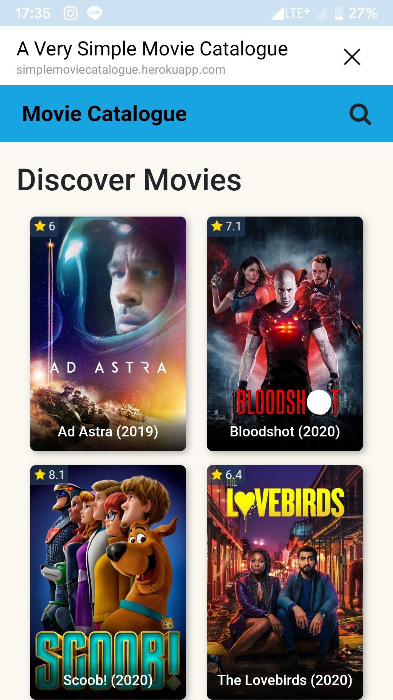
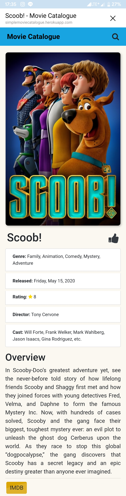

# MovieCatalogue-LIFF
Basically the same as my android The Movie Catalogue, but you can run this on any browser you have on your phone and computer.
And if you run this from LINE Messengers app, you can get LIFF (LINE Front-end Framework feature as no browser version has.

## Screenshot
&nbsp;

### App Features
* [x] Showing movies
* [x] Search movies
* [x] Detail movies
* [x] Share movies

### My LIFF
https://liff.line.me/1653723806-zZml2obV (or you can access https://simplemoviecatalogue.herokuapp.com)
* If you find any trouble, make sure you don't use safari browser

### Configuration
- `MOVIE_DB_API` at `api-transaction.js`: Your TMDB API key
- `defaultLiffId` at `liff.js`: From LINE Developers
- Endpoint URL at LIFF LINE Developers: Your domain

### Licenses
- [LINE Front-end Framework SDK](https://developers.line.biz/en/docs/liff/)
- [Bootstrap](https://getbootstrap.com/docs/4.3/getting-started/introduction)
- [Font Awesome](https://github.com/FortAwesome/Font-Awesome)
 
## Author
* **Fahmi Al Kautsar**