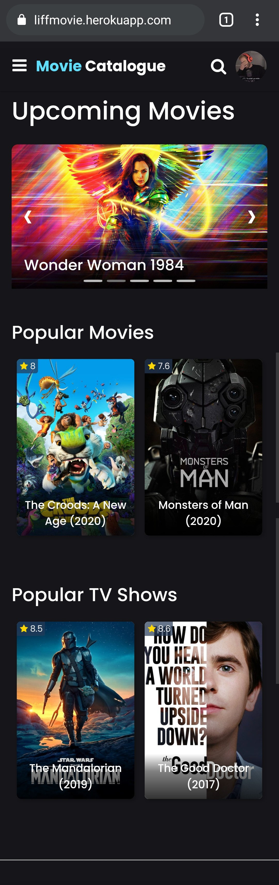

# MovieCatalogue-LIFF
Basically the same as my android The Movie Catalogue, but you can run this on any browser you have on your phone and computer.
And if you login with your LINE Messenger account, you can get Watchlist feature. This can be happened with the help of LIFF (LINE Front-end Framework).

## Screenshot
* this is an old version's
&nbsp;

### App Features
* [x] Discover Movies & TV Series Information
* [x] Movies & TV Series Search
* [x] Watchlist

### Sample
https://liff.line.me/1653723806-zZml2obV (or you can access https://liffmovie.herokuapp.com)

### Configuration
- `MOVIE_DB_API` at `index.js`: Your TMDB API key
- `LIFFID` at `index.js`: From LINE Developers
- Endpoint URL at LIFF LINE Developers: Your domain

### Licenses
- [TMDB](https://developers.themoviedb.org/3)
- [LINE Front-end Framework SDK](https://developers.line.biz/en/docs/liff/)
- [Node.js](https://nodejs.org/en/docs/)
- [PostgreSQL](https://www.postgresql.org/docs/)
- [Bootstrap](https://getbootstrap.com/docs/4.3/getting-started/introduction)
- [Font Awesome](https://github.com/FortAwesome/Font-Awesome)
 
## Author
* **Fahmi Al**